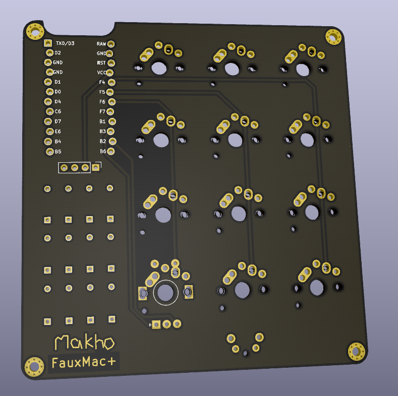

# fauxmac
Romac+ Macro Pad remade because the original is no longer for sale

It should use the same firmware as the official QMK repo Romac+ but things may have to be tweaked slightly. Uses a LED strip instead of four SMT RGB LEDs soldered to the bottom. You can use as many as you want but make sure to tweak the firmware if you use more than four. 

Case sizing IS different. I don't know what the original is sized at but mine is sized 83.8mm wide by 88.0mm tall. Mounting hole spacing is 77.8mm wide by 82.0mm tall. Key spacing is 19.0mm 
